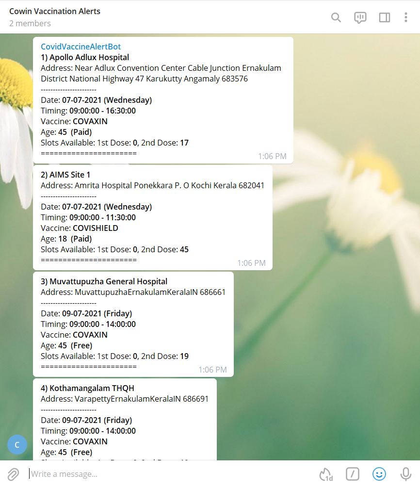

#  Cowin Vaccination Alerts 💉
- A Python based Telegram bot to get hourly updates on avaiable vaccination slots.
- No more fastest-finger-first and refreshing the booking page for whole day. 
- ✨Just  automate using the power of Python and relax!✨

[](#)            [](https://t.me/joinchat/9XZEeH-HrcxiNDI1)  [](https://github.com/Nikhil-Patro/CowinVaccinationAlerts)


## Screenshots 📸


## Demo Video 🎥
Youtube demo link - 

## Installing 💻
The bot is already hosted on Heroku and running smoothly. Posts hourly updates on the telegram group regarding all the avaiable vaccination slots and their corresponding details.
Telegram group - [LINK](https://t.me/joinchat/9XZEeH-HrcxiNDI1)

Since the bot is currently running on free dynos which has only a limited number of hours, it might stop running in the future. In such case you can install Cowin Vaccination Alerts bot locally by:
```
$ git clone https://github.com/Nikhil-Patro/CowinVaccinationAlerts.git
$ cd CowinVaccinationAlerts
$ python install -r requirements.txt
$ python script.py
```
Make sure to add your personal bot's ```API_TOKEN``` and your groups ```CHAT_ID``` in ```script.py```
Now your personal bot is up and running locally on your computer !


## Tech Stack 🛠️
Beginner friendly tech stack - 
- Python (v3.9)
- Python packages like requests(2.25.1) and schedule(1.1.0)

## Development 🌏

Want to contribute? Great! Feel free to make PR's and add new functionalities 😊


